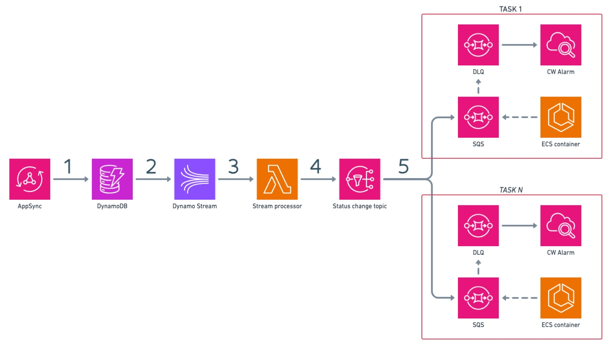

# Welcome to Fargate Notifications CDK project!

README is not ready yet. But you can check the code and try to deploy it.

Meanwhile, here the HL architecture of the project:

## How to deploy
WIP

## Useful commands

* `npm run build`   compile typescript to js
* `npm run watch`   watch for changes and compile
* `npm run test`    perform the jest unit tests
* `npx cdk deploy`  deploy this stack to your default AWS account/region
* `npx cdk diff`    compare deployed stack with current state
* `npx cdk synth`   emits the synthesized CloudFormation template
