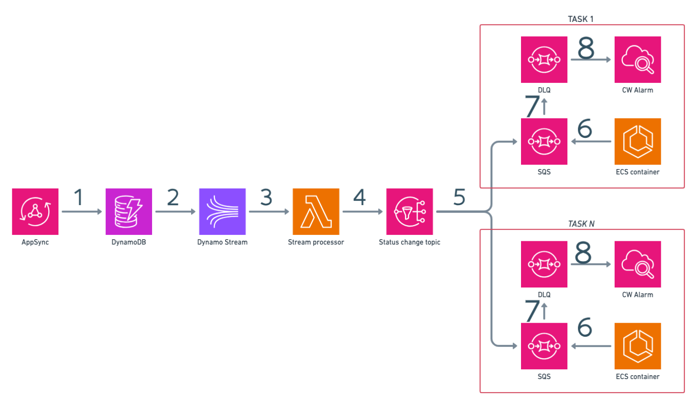

# Welcome to Fargate Notifications CDK project!

This project is a simple CDK project that deploys a Fargate service with containers that receive notification of dynamic changes leveraging fan-out pattern based on SNS and SQS.

## The project
The scope of the project is to measure time taken by each components in the chain to process events down to the Fargate service. The project is composed by the following components:
- AppSync API: it's the entry point for the events. It's a GraphQL API that accepts mutations to send events to the Fargate service.
- DynamoDB: it's used to store the events
- Dynamo stream: it's used to trigger the Lambda function that sends the events to the SNS topic
- Lambda function: it's used to send the events to the SNS topic
- SQS: it's used to buffer the events before sending them to the Fargate service single containers



1. The AppSync API receives mutations and stores derived data in the DynamoDB table
2. The DynamoDB stream the events 
3. The Lambda function is triggered by the DynamoDB stream
4. The Lambda function sends the events to the SNS topic
5. The SNS topic sends the events to the SQS queues
6. The Fargate service reads the events from the SQS queues
7. If events are not processed within a timeout, they are moved to the DLQ
8. A Cloudwatch alarm is triggered if the DLQ is not empty

Custome metrics are also created to measure the time taken by each component to process the events, so you can use cloudwatch to create dashboards and alarms based on these metrics.

Here an example board


## How to deploy
Use the .env file to set the environment variables. The following variables are required:
- MIN_TASKS: the minimum number of tasks to run in the Fargate service
- MAX_TASKS: the maximum number of tasks to run in the Fargate service
- DESIRED_TASKS: the desired number of tasks to run in the Fargate service
- TASK_CPU: the CPU units to allocate to the tasks
- TASK_MEMORY: the memory to allocate to the tasks
- STATS_PRINT_MILLIS: the interval in milliseconds to print sqs client's stats
- SQS_VISIBILITY_TIMEOUT: the visibility timeout in seconds for the SQS queues
- SQS_RECEIVE_MESSAGE_WAIT_SECONDS: the time in seconds to wait for messages to be available in the SQS queues before polling again
- SQS_MAX_RECEIVE_COUNT: the maximum number of times a message can be received before being sent to the DLQ
- STREAM_PROCESSOR_LAMBDA_MEMORY: Dynamo stream processor lambda memory

At the first run you need to bootstrap the CDK environment with the following command:
```bash
npx cdk bootstrap
```

Then you can deploy the stack with the following command:
```bash
npx cdk deploy
```
Since i wanted to have fargate tasks marked as healty when their SQS were deployed, SQS queues, SQS subscriptions and alarms are created within the task container using SDK.
In order to "bundle" tasks with related resources, all resources created by the task with SDK has been tagged with the `task id`, so you can easily identify them. 
Queues are also named as `task id` and `task id`-`dlq`.

The container handles the `SIGTERM` signal to delete the SQS subscriptions and the queues before the container is stopped.
This works well while scaling up and down, but not when you destroy the stack because `SIGKILL` is sent to the container and the cleanup is not performed.
To avoid this i suggest to perform a deploy setting the desired tasks to 0, then wait for the tasks to be stopped and then destroy the stack.
If you forgot to scaledown to 0 the tasks, you can use the following command to clean up remaining resources:

```bash
./scripts/cleanup.sh
```

## How to run the project
Once the stack is deployed, you can use the AppSync API to send events to the Fargate service. You can use the following mutation to send an event:
```graphql
mutation {
  addStatus(input: {
    status: "Hello world"
  }) {
    id
    status
  }
}
```
`id` is autogenerated by appsync and is the id of the event and `status` is the message you want to send to the Fargate service.

The application exposes an endpoint to retrieve single task informations: its exposed under the `/sqs` path and it's a GET method.
Since application is behind a load balancer, at each invocation the request is routed to a different task, so you can see the load balancing in action.

## How to monitor
As messages starts to flow in the system deployed metrics filters start to grab informations, so you can create a dashboard to monitor the application using custom metrics created under `Fgnt` namespace and called `sqsTimeTakenMillis`, `snsTimeTakenMillis`, `openPollings`,`processedMessages` and `discardedMessages`, along with provided metrics such as `CPUUtilization` and `MemoryUtilization`.


## Useful commands

* `npm run build`   compile typescript to js
* `npm run watch`   watch for changes and compile
* `npm run test`    perform the jest unit tests
* `npx cdk deploy`  deploy this stack to your default AWS account/region
* `npx cdk diff`    compare deployed stack with current state
* `npx cdk synth`   emits the synthesized CloudFormation template
